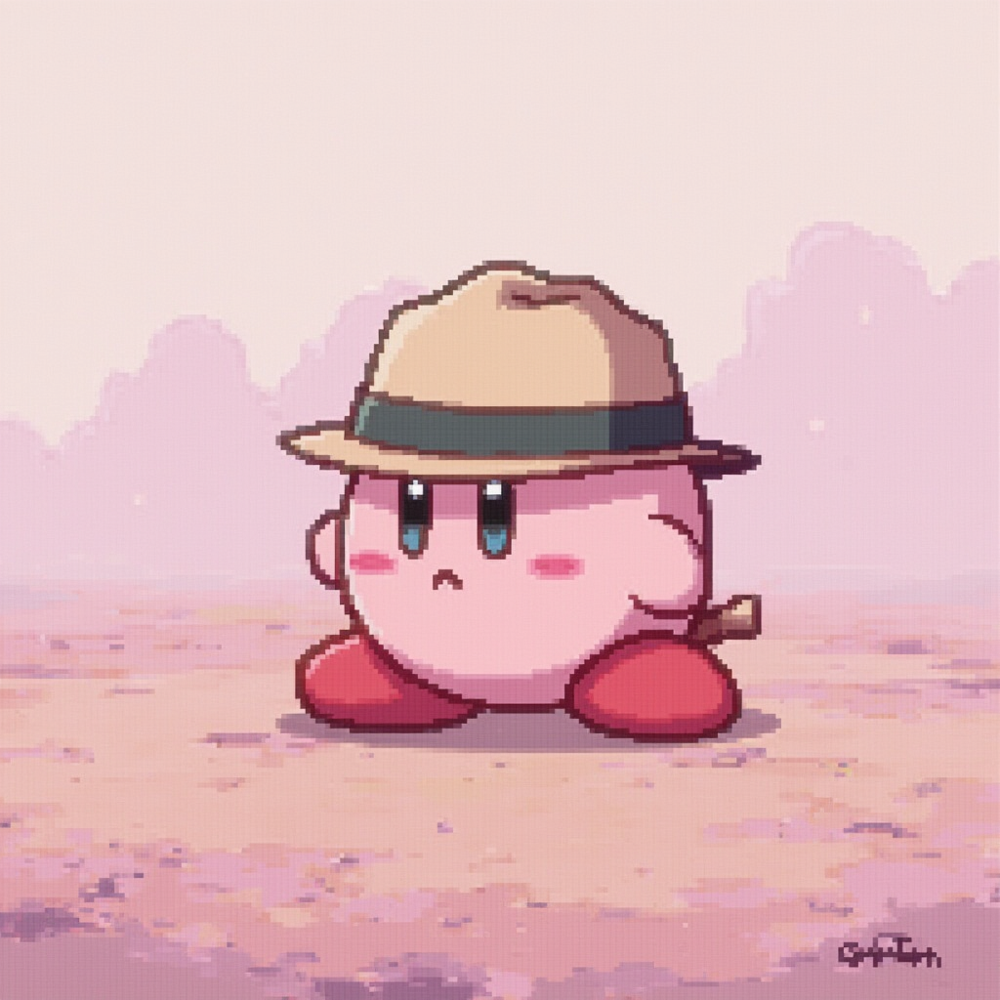
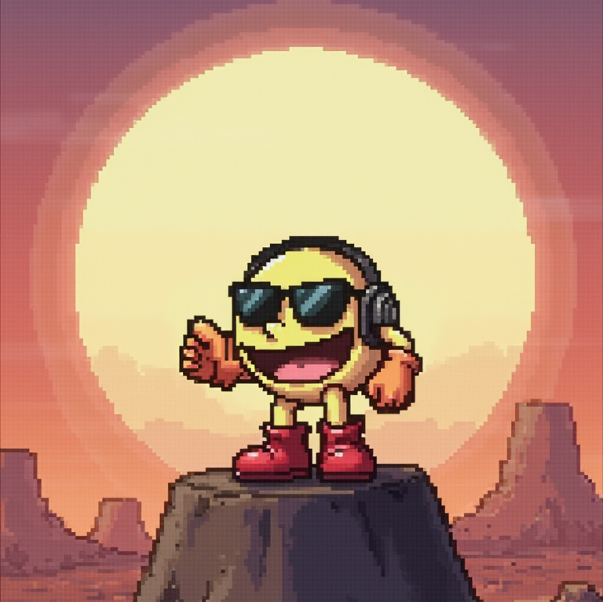

    preview do podcast

    <audio src="output/podcast_editado.MP3" controls title="Podcast editado"></audio>

# Projeto Podcast Gerado por I.A.s
|  título  | Vamos lá, me escreva um titulo de um post sobre IA com um estilo em função de chamar atenção de um público curioso quanto ao assunto, o nicho é ia, e eu gostaria de subnichos antes de vc me dar uma resposta sobre os itens anteriores.                                                       |
| conteúdo | Valeu, agora vc pode fazer txts focando nos respectivos temas que vc sugeriu antes? {regras} >Explique sempre de uma maneira simples ( pode ser divertida, pois não quero que o leitor fique desinteressado, então use as técnicas q sabe para evitar isso, por favor ) >deixe o texto enxuto >se possivel, traga exemplos interessantes, considere que nem todas as pessoas serão iguais, mas meu público alvo é adolescente. Creio q vc conhece a situação dos jovens atualmente, então se baseie nisso. |
ChatGPT：

 > ℹ️ **NOTE:** Este é o repositório desenvolvido durante meu período cursando a [DIO](https://dio.me)

## 🧠 Prompts

|   Ação   | prompt                                                                                                                                                                                                                                                                         |
| :------: | ------------------------------------------------------------------------------------------------------------------------------------------------------------------------------------------------------------------------------------------------------------------------------ |
|  título  | Você agora é roteirista de podcast, e vamos criar um podcast de tecnologia focado em 'Cultura Geek'. Eu gostaria de uma ajuda sua para criar cinco sugestões de nomes criativos para um 'podcast geek' feito por nerds. Então, você pode criar trocadilhos a partir desse tema: {Rules} Nome enxuto; Nome e subtítulo; Nome com trocadilho (com nomes de franquias conhecidas como Kimetsu no Yaiba, Black Clover, Blue lock, Minha querida Oni, etc... ); Palavra que remeta ao Geek|

| conteúdo | Você é um roteirista de podcast, e vamos criar um  roteiro de um podcast de focado em cultura geek cujo o nome é "GeekCast - Magia, Conteúdo e Diversão",  com o público alvo sendo jovem-adulto. (vc pode usar o canal "Jovem Otaku" de referência). O formato do roteiro deve ser: [INTRODUÇÃO], [CURIOSIDADE 1], [CURIOSIDADE 2] e [FINALIZAÇÃO] / {REGRAS} no bloco [INTRODUÇÃO] substitua por uma introdução iguais as introduções dos vídeos do canal "Jovem Otaku"; no bloco [CURIOSIDADE 1] substitua por curiosidades geeks interessantes e que cativem meu público; no bloco [CURIOSIDADE 2] sobre algum anime como Kimetsu ou então fale sobre os eventos geek que ocorrem no Brasil ( escolha o que preferir ); no bloco [FINALIZAÇÃO] substitua por uma despedida cool com o final 'Eu sou Kaik, e essas foram as informações nerds dessa semana'; use termos de fácil explicação; O podcast vai ser apresentado somente por uma pessoa, chamada kaik; O podcast deve ter 5000 caracteres / {REGRAS NEGATIVAS} Não use muitos termos técnicos; Não coloque datas com números, escreva por extenso |

Shakker AI：

|  Ação  | prompt                                                                                 |
| :----: | -------------------------------------------------------------------------------------- |
| títulos | Create an image in pixel art style and in the center place a Pacman with a white headset, beneath it there will be a block of earth and the background will be scorched in the #F5F5DC radial gradient tone. /  Create an image in pixel art style and in the center place a Kirby with a cap, the background will have a misty texture in shades of pink with a lighter gradient. |

Projeto com o objetivo de gerar um podcast utilizando ferramentas de IA através de prompts mais trabalhados.

## 💻 Tecnologias utilizadas no projeto

- [ChatGPT](https://chat.openai.com/) 
- [Shakker AI](https://www.shakker.ai/pt/home)
- [Capcut](https://www.capcut.com/pt-br/)

## ✨ Como foi feito ?

- Roteiro gerado via chatgpt
- Audio gerado pelo Capcut, além de tratá-lo e adicionar sons de fundo
- Shakker AI Para gerar capas

## 📚 Materiais

- [Notion Template](https://helpful-jump-17b.notion.site/PAS-Podcast-AI-Studio-210489e15d7a4a73b743bb159e45d06f?pvs=4)
- [Editor de aúdio](https://www.capcut.com/editor?from_page=landing_page&__action_from=picture_V%C3%ADdeos%20profissionais%20em%20minutos,%20n%C3%A3o%20em%20horas.)

## 🛠️ Instruções de execução

Utilizei os prompts dentro do link do `Notion` fornecido na parte de `Materiais` para criar um podcast de maneira automatizada, para isso segui o passo a passo abaixo.

- 🤖 1. Usei os prompts de roteiro no `chagpt`
- 🤖 2. Usei os prompts de roteiro gerados pelo chatgpt no  `Capcut`
- 🤖 3. Usei os prompts de artes no `Shakker AI`

    
    
&nbsp&nbsp&nbspKaik Klydson 
    &nbsp&nbsp&nbsp
    <a 
        href="https://github.com/Caspioif">
        GitHub
    </a>
   

---

⌨️ com 💜 por [Felipe Aguiar] Valeu Felipão!
